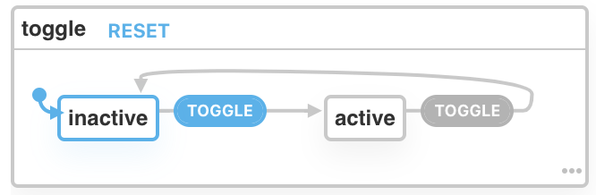

# An Introduction to State Machines using xstate

State machines are an old concept. They are a proven solution that provides a solid architectural foundation for application processes. In this article, I hope to provide an introduction to what they are and how they can be useful for a modern web or mobile application engineer. We'll be focusing on one library in particular - [xstate](xstate.org) - and how it can allow anyone to easily leverage state machines for managing global or component state.

## What are State Machines?

### Definition of a State Machine

State machines allow for encapsulation of the specific states an application can be in at any given time. The definition of any given state machine consists of a few specific items. These include:

1. A set of given states (one of which is the initial state, and possibly a final state)
2. A number of events (these allow for transitions between the states)
3. Transition functions that take an event and then output the next state

Even foregoing the actual mathematical model and specification that defines the concept of a state machine ([more here](https://en.wikipedia.org/wiki/Finite-state_machine)), these points can seem a bit dry. I have found it easiest to learn by example. Let's take a look at a simple state machine and break it down.

### A Simple Example



Here we have a visual representation of a simple state machine that has two defined states (`inactive` and `active`). In this machine, the initial state is `inactive`; it does not have a final state. The only event is `TOGGLE` which, when sent to the machine, will transition it to the only other state that can occur: `active`. Once transitioned to `active`, the `TOGGLE` event can only transition the machine to `inactive`. This will proceed back and forth indefinitely, hence the lack of a final state.

You can view the example online [here](https://xstate.js.org/viz/?gist=bd2b2f9caf3838f1c2f0a58bbf2101bc). This is using a tool called the xstate visualizer, which allows you to interact with state machines. Try clicking the `TOGGLE` event and watch the machine transition to `active` and back to inactive. Try adding another state or changing the name of the event and you can see the visual update as you make changes.

## How are they useful?

To get right down to it, I think the most important feature of state machines compared to other state management solutions is the fact that the machine can only exist in one state at a time, and therefore can only transition to another state if that state is accessible via one of the events. This restriction alone makes all the difference. It prevents invalid states from being reached at any point in time. It also allows for type-safe assertions of what data is available in the state context based on the current state of the machine. In applications using a library like `xstate`, this translates to type-safe, declarative configuration for the state of the application, and fewer bugs attributable to component architecture, race conditions, or user input.

Let's look at an example of this is a real (trivial) application, using our Toggle example from above.

> The code referenced in this example is available [here](todo link)

### The Machine

```typescript
import { createMachine } from "xstate";

interface ToggleContext {}

type ToggleEvent = { type: "TOGGLE" } | { type: "BANANA" };

type ToggleState =
  | {
      value: "inactive";
      context: ToggleContext;
    }
  | {
      value: "active";
      context: ToggleContext;
    };

export const toggleMachine = createMachine<
  ToggleContext,
  ToggleEvent,
  ToggleState
>({
  id: "toggle",
  initial: "active",
  states: {
    inactive: {
      on: { TOGGLE: "active", BANANA: "active" }
    },
    active: {
      on: { TOGGLE: "inactive" }
    }
  }
});
```

The first thing you may notice is that this is written using TypeScript. TypeScript is encouraged for use with state machines. There are some benefits when consuming the machine that come from type-narrowing in TypeScript, but that's a bit outside the scope of this article. For more, check out the great [documentation](https://xstate.js.org/docs/guides/typescript.html#using-typescript).

We've also added a secondary action to our `inactive` state - an event we're calling `BANANA`.
